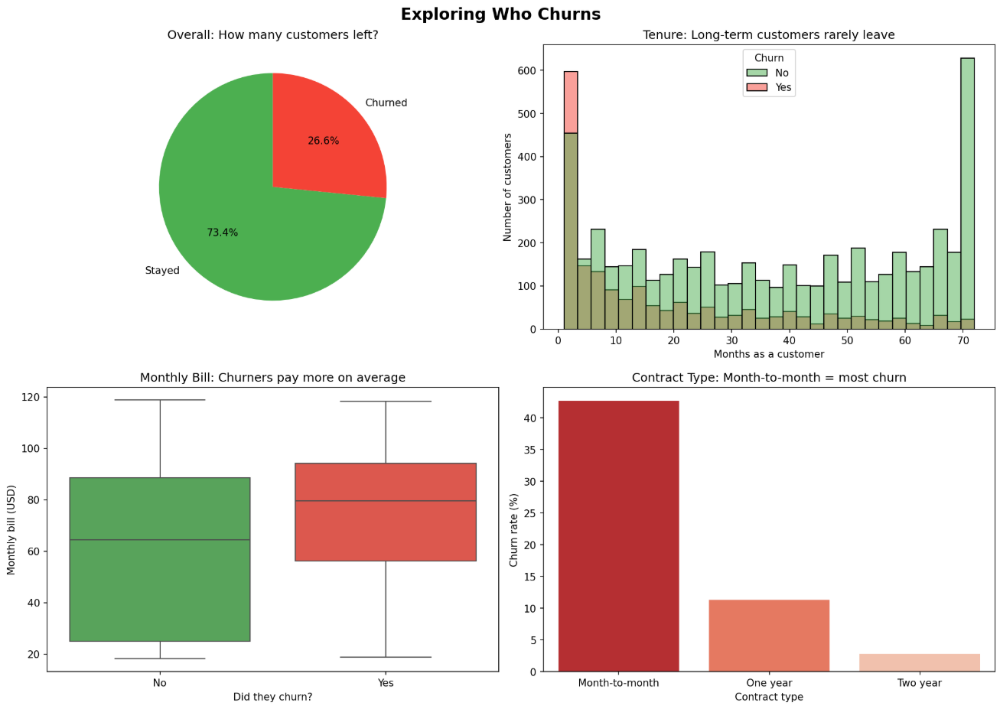
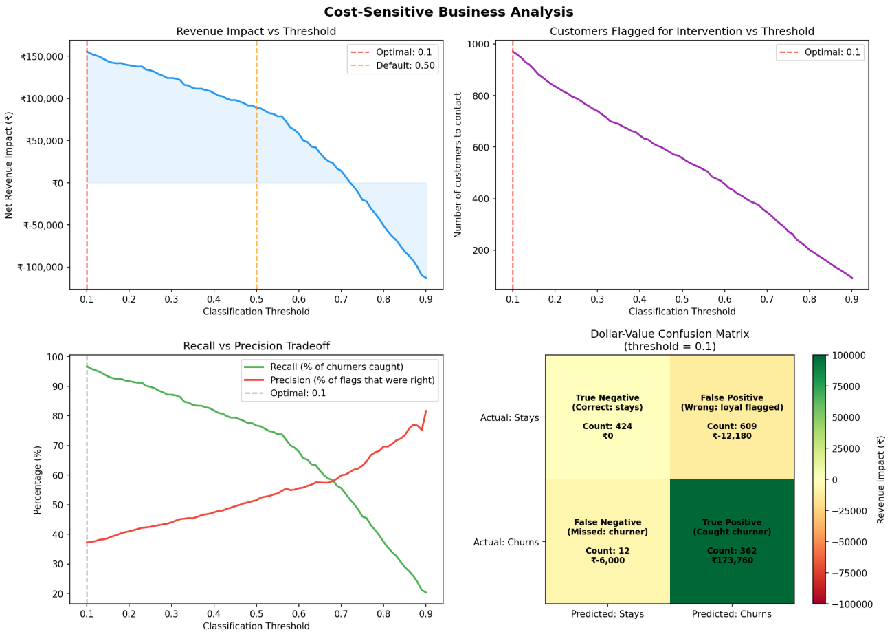
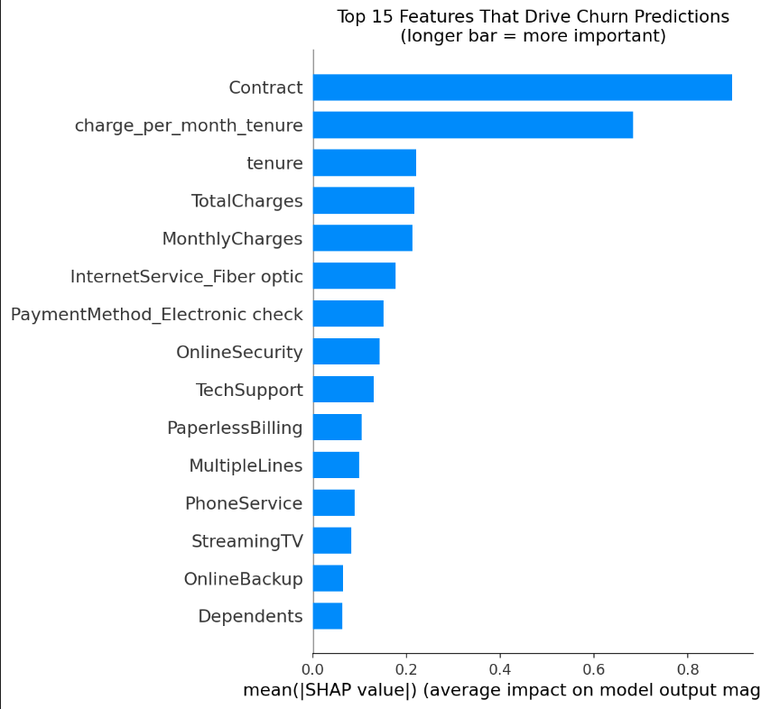
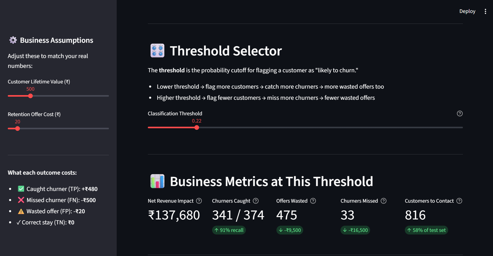

# 📉 Churn Prediction with Business Framing
 
> A cost-sensitive machine learning project that goes beyond accuracy —  
> every prediction is tied to a dollar value, and every decision is justified by revenue impact.
 
---
 
## 🔍 The Problem
 
A phone company has thousands of customers paying every month. Some of them are quietly planning to cancel — and the company has no idea who.
 
The goal of this project is to **predict which customers are about to leave (churn)** before they actually do, so the retention team can step in with a targeted offer and save them.
 
But most churn projects stop at "my model is 85% accurate." This project asks a better question:
 
> **What does a wrong prediction actually cost the business?**
 
Missing a churner costs ~₹500 in lost lifetime revenue. Wrongly flagging a loyal customer wastes ~₹20 on an unnecessary offer. These are not equal mistakes — and this project builds a model that reflects that asymmetry.
 
---
 
## ✨ What Makes This Project Different
 
| Typical Churn Project | This Project |
|---|---|
| Optimises for accuracy / AUC | Optimises for **net revenue saved** |
| Uses default 0.5 threshold | **Tunes threshold** to maximise business impact |
| Reports precision and recall | Reports **dollar-value confusion matrix** |
| One model output | **3-tier intervention strategy** (high / medium / low risk) |
| Black box predictions | **SHAP explainability** — why was each customer flagged? |
| Static script | **Interactive Streamlit dashboard** with live sliders |
 
---
 
## 📦 Dataset
 
- **Name:** IBM Telco Customer Churn
- **Source:** [Kaggle — Telco Customer Churn](https://www.kaggle.com/datasets/blastchar/telco-customer-churn)
- **Size:** 7,043 customers, 21 columns
- **Churn rate:** ~26% (imbalanced dataset)
- **Key columns:** tenure, MonthlyCharges, Contract type, InternetService, TotalCharges, Churn (Yes/No)
> Download the CSV and save it as `data/telco_churn.csv` in the project root.
 
---
 
## 🛠️ Tech Stack
 
| Library | Purpose |
|---|---|
| `pandas` | Data loading, cleaning, and manipulation |
| `numpy` | Numerical operations |
| `matplotlib` / `seaborn` | Charts and visualisations |
| `scikit-learn` | Logistic Regression, train/test split, metrics |
| `xgboost` | Champion model — ensemble of decision trees |
| `imbalanced-learn` | Handling the 74/26 class imbalance |
| `shap` | Explainability — why did the model flag this customer? |
| `streamlit` | Interactive business dashboard |
| `pickle` | Saving trained models and data between steps |
 
---
 
## 📁 Project Structure
 
```
churn_project/
│
├── data/                        ← Place telco_churn.csv here (not pushed to GitHub)
├── outputs/                     ← Auto-generated charts and models (not pushed to GitHub)
│
├── step1_load_explore.py        ← Load data, EDA, 4 exploratory charts
├── step2_prepare_data.py        ← Clean data, encode features, train/test split
├── step3_train_model.py         ← Train Logistic Regression + XGBoost, compare
├── step4_cost_matrix.py         ← Dollar-value confusion matrix, threshold optimisation
├── step5_shap_explain.py        ← SHAP feature importance and single-customer explanation
├── step6_app.py                 ← Streamlit interactive dashboard
│
├── .gitignore                   ← Excludes data/ and outputs/ from GitHub
└── README.md                    ← This file
```
 
---
 
## ▶️ How to Run
 
**1. Install dependencies (run once)**
```bash
pip install pandas numpy matplotlib seaborn scikit-learn xgboost lightgbm imbalanced-learn shap streamlit
```
 
**2. Download the dataset**  
Get it from [Kaggle](https://www.kaggle.com/datasets/blastchar/telco-customer-churn) and save as `data/telco_churn.csv`
 
**3. Run each step in order**
```bash
python step1_load_explore.py      # Explore the data — outputs 4 charts
python step2_prepare_data.py      # Clean and prepare — saves prepared_data.pkl
python step3_train_model.py       # Train models — saves best_model.pkl
python step4_cost_matrix.py       # Business analysis — saves cost_analysis.pkl
python step5_shap_explain.py      # Explainability — saves shap_values.pkl
streamlit run step6_app.py        # Launch interactive dashboard in browser
```
 
> ⚠️ Steps must be run **in order** — each step saves output files that the next step loads.
 
---
 
## 💰 The Cost Matrix
 
This is the core business insight. Every prediction the model makes falls into one of 4 boxes — each with a real rupee value attached:
 
|  | Predicted: Stays | Predicted: Churns |
|---|---|---|
| **Actual: Stays** | ✅ True Negative — ₹0 (do nothing, correct) | ⚠️ False Positive — **-₹20** (wasted offer) |
| **Actual: Churns** | ❌ False Negative — **-₹500** (lost customer) | 🎯 True Positive — **+₹480** (saved customer, minus offer cost) |
 
Missing one churner costs **25x more** than a wasted offer. So the model is tuned to catch more churners, even at the cost of a few extra false alarms.
 
---
 
## 📊 Results
 
| Metric | Value |
|---|---|
| Baseline model (Logistic Regression) AUC | `[run step3 to get this]` |
| Champion model (XGBoost) AUC | `[run step3 to get this]` |
| Customers who would churn (test set) | 374 |
| Revenue lost doing nothing | -₹1,87,000 |
| Revenue impact at default threshold (0.50) | ₹88,860 |
| Optimal threshold found | 0.10 |
| Revenue impact at optimal threshold | ₹1,55,580 |
| Extra revenue from tuning threshold | +₹66,720 |
| Churners caught at optimal threshold | 362 out of 374 **(96.8% recall)** |
| Customers flagged for intervention | 971 |
| **Total improvement over doing nothing** | **+₹3,42,580** |
 
---
 
## 🎯 Intervention Strategy
 
Based on predicted churn probability, customers are split into 3 tiers:
 
| Tier | Probability Range | Action | Rationale |
|---|---|---|---|
| 🔴 High Risk | p ≥ 0.70 | Personal call + loyalty offer | High chance of leaving, justify full spend |
| 🟡 Medium Risk | 0.40 ≤ p < 0.70 | Email nudge + feature highlight | Worth a low-cost touch |
| 🟢 Low Risk | p < 0.40 | Monitor only — no spend | Cost of intervention outweighs risk |
 
---
 
## 🔍 Key Insights from the Analysis
 
- Month-to-month contract customers churn at roughly **3x the rate** of customers on annual plans
- Customers who leave tend to do so **within the first 12 months** — long-tenure customers rarely churn
- Customers who churn pay **higher average monthly bills** than those who stay
- Lowering the classification threshold from 0.50 to **0.10** increased revenue saved by **+₹66,720**
- At the optimal threshold, the model catches **362 out of 374 churners** — a 96.8% recall rate
- The model turns a **₹1,87,000 loss** (doing nothing) into a **₹1,55,580 gain** — a total swing of **₹3,42,580**
---
 
## 🖥️ Screenshots
  
```




```
 
---
 
## 🚀 Future Improvements
 
- **Real CLV data** — replace the fixed ₹500 estimate with actual customer lifetime value per segment
- **Deploy online** — host the Streamlit dashboard on [Streamlit Cloud](https://streamlit.io/cloud) so anyone can use it without running code locally
- **Live scoring** — connect the model to a database so new customers are automatically scored each week
- **More models** — try LightGBM or CatBoost and compare against XGBoost with a proper cross-validation pipeline
- **A/B test the strategy** — measure whether the 3-tier intervention actually reduces churn in practice
---
 
## 🧠 What I Learned
 
This project taught me that machine learning accuracy is not the same as business value. A model can be 85% accurate while being nearly useless — if it mostly predicts "no churn" and never catches the customers who are actually leaving.
 
The key insight is that **different types of wrong predictions have different costs**, and building a model that respects that asymmetry is what separates a data science project from a real business tool.
 
---
 
## 👤 Author
 
**[Your Name]**  
📎 [LinkedIn](https://www.linkedin.com/in/shanvi-agarwal-93b38928b/)  
🐙 [GitHub](https://github.com/SanviAgarwal)